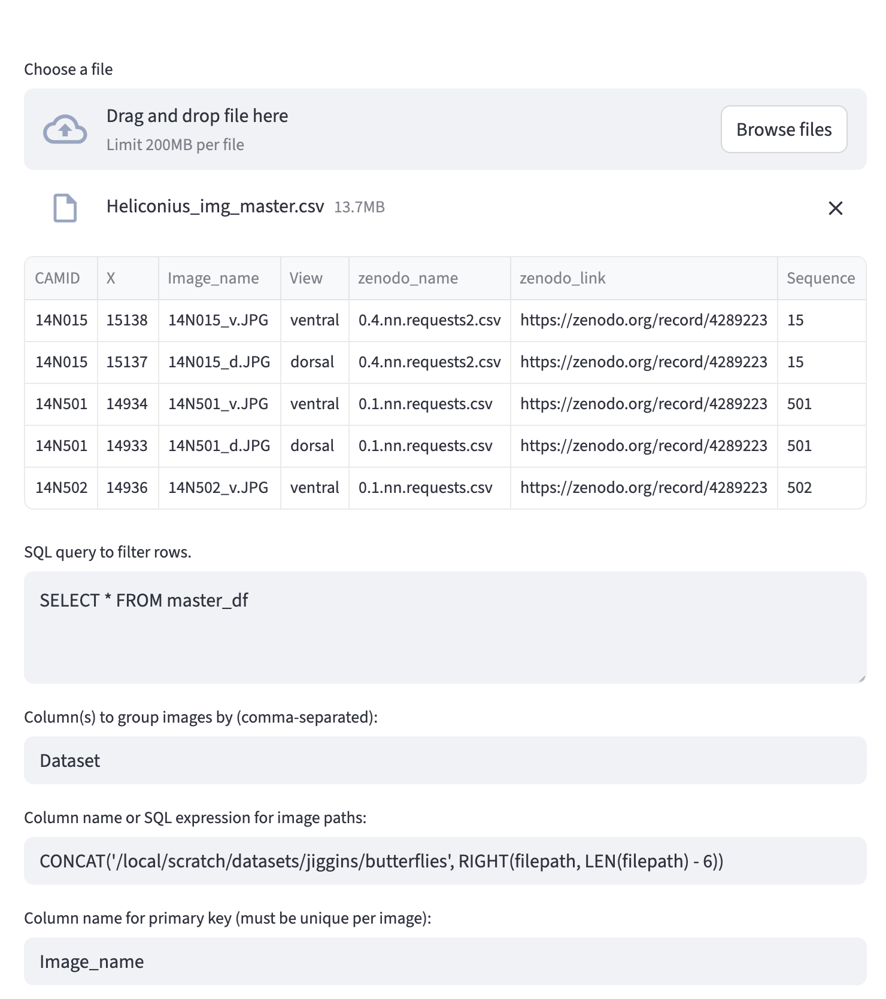
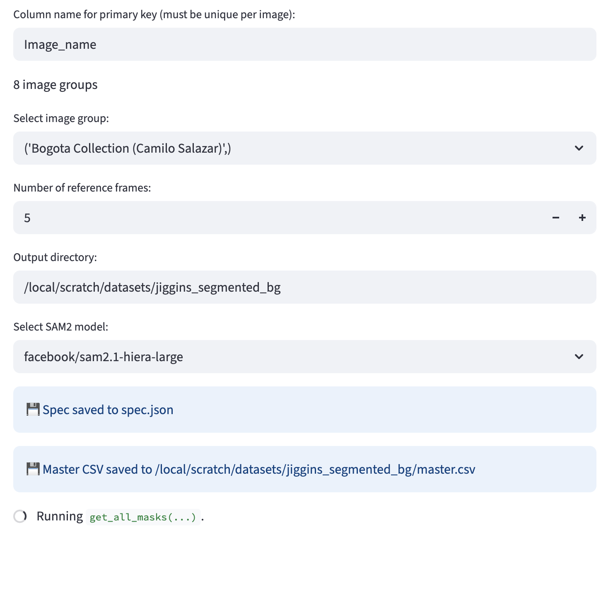
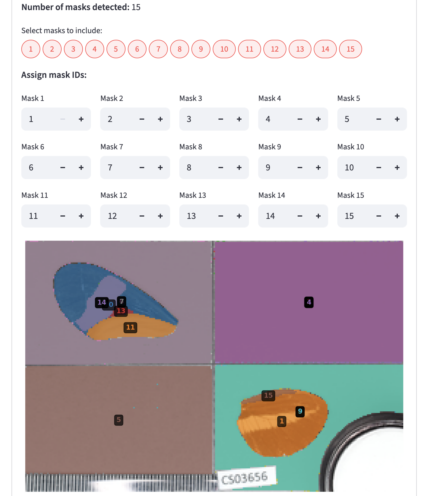
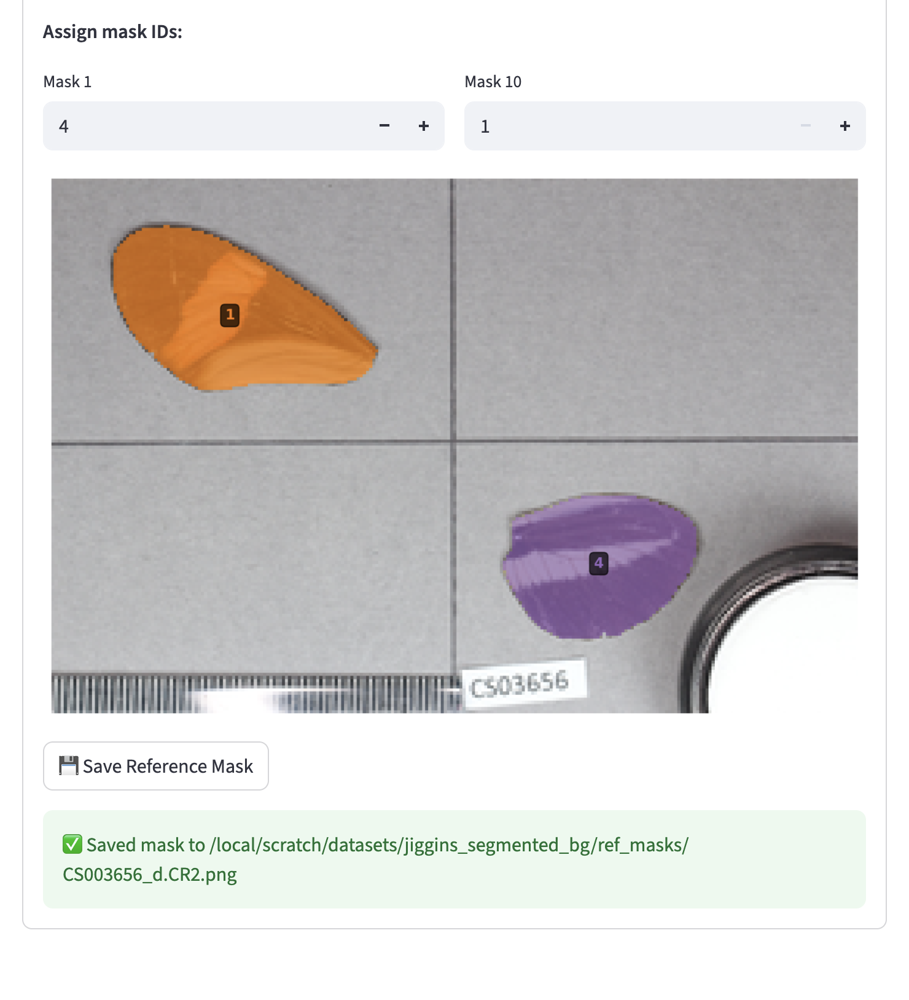
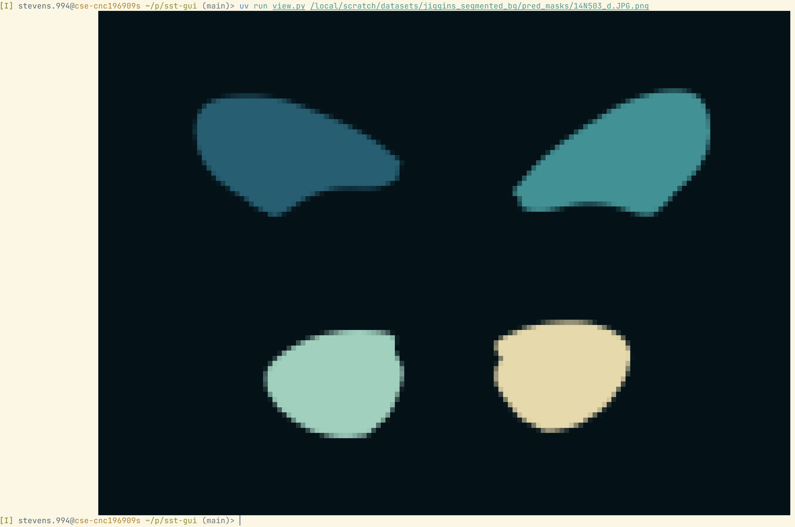

# SST-GUI

This repo is a GUI (via [Streamlit](https://streamlit.io/)) for the idea presented in [SST](https://arxiv.org/abs/2501.06749).

1. Run `uv run streamlit run gui.py`. This starts a Streamlit app (which you can open in a browser) to specify where your images are located, speciy how to group images, and pick out reference frames and the corresponding masks. All of this data will be saved in a `spec.json` file.
2. Run `uv run inference.py spec.json`. The `spec.json` file will include all of the decisions you made with the GUI, and will then generate masks for the rest of the images using SAM 2 and the reference masks you generated with the GUI.

# GUI

First, upload metadata and tell the system how to get your images.

Then wait for SAM 2 to get all masks (with no prompt) from 5 images.

Then filter the masks to the objects you care about and label the objects with integer ids.

Finally, save your masks to disk. Then run `uv run inference.py spec.json`.

You can validate that your images work by using `uv run view.py PATH`:

